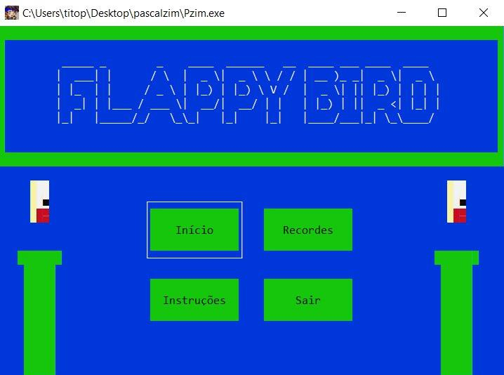
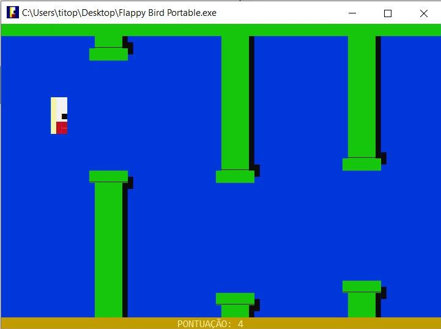

<h1 align="center">
   
  
   
  Flappy Bird
   
</h1>

O game possui o objetivo de simular uma interface gráfica de um jogo através de movimentos dos caracteres especiais contidos na tabela ASCII para obteção de   desenhos como os canos, as bordas, o pássaro e os demais itens do mesmo.

O jogo foi criado para fins didáticos no Pascalzim, então o código é livre para edição e sem licença, portanto pode ser editado e melhorado. Por favor se houver qualquer bug pode nos avisar em um dos contatos acima!

> Devido a linearidade do código o pássaro descreve um movimento constante em sua queda e deste modo complicando a aplicação de efeito de aceleração da gravidade.

> Jogo funciona com cores mais apresentáveis na versão 6.0.1 do Pascalzim, pois no jogo foi utilizado um comando de cor de fundo do texto e a versão 6.0.2 ou superior não permite o uso de cores claras como LIGHTGREEN, mas só irá mudar a percepção das cores de alguns lugares.

|  |  |
|-----------------------------------------------------------|------------------------------------------------------|

## Instalação
O jogo só funciona corretamente no Windows, para instalar o jogo execute [`Arquivos/flappybird.exe`](Arquivos/flappybird.exe), para somente executar a versão portable, sem precisar instalar execute [`Arquivos/Flappy Bird Portable.exe`](Arquivos/Flappy%20Bird%20Portable.exe).

## Contribuir
Contribuições são o que tornam a comunidade de código aberto um lugar incrível para aprender, inspirar e criar. Todas as contribuições que você fizer são muito bem vindas!
Para ver e modificar o código, utilize este compilador: [Pzim](http://pascalzimbr.blogspot.com/) e abra o arquivo [`FlappyBird 1.0.pas`](FlappyBird%201.0.pas)

## Autores
* Mauricio Taffarel - [taffarel55](https://github.com/taffarel55)
* Jonathan Xavier - [JonathanXP](https://github.com/JonathanXP)

##### Agradeço a Isaac Araújo por gerar as imagens deste README - [isaacpcaraujo](https://github.com/isaacpcaraujo)

## Licença
[MIT](https://github.com/taffarel55/FlappyBird/blob/master/LICENSE)
